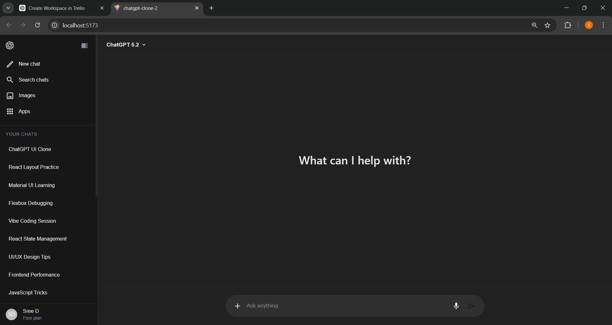
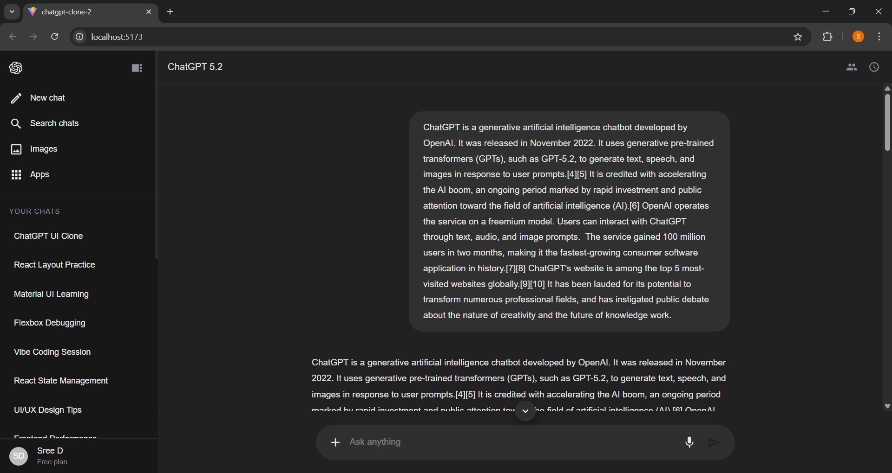
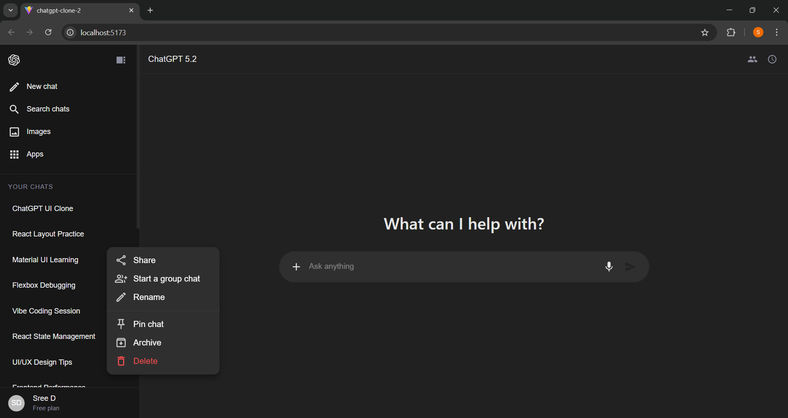
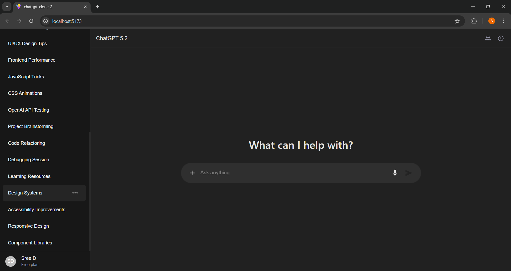
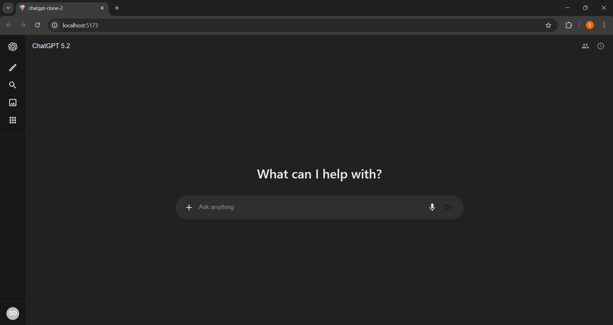
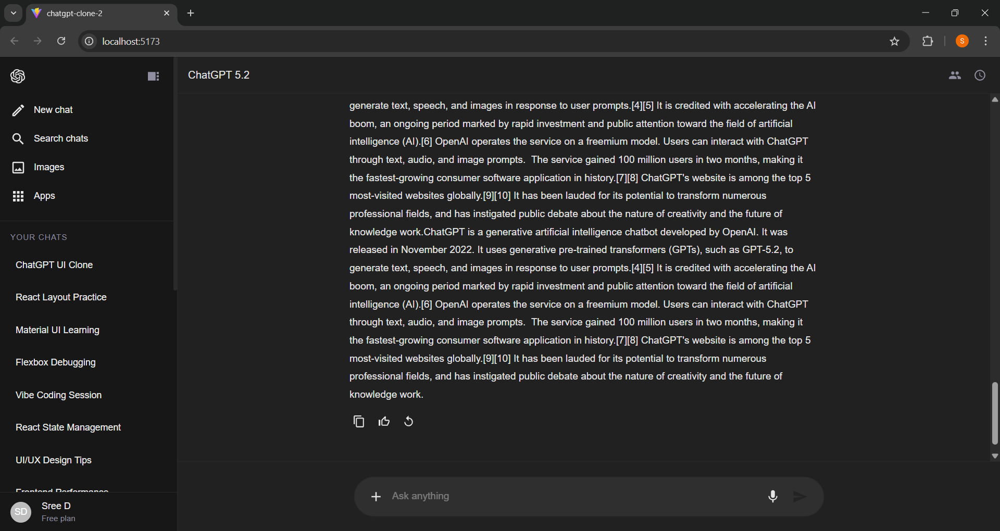

# ChatGPT UI Clone (React + MUI)

A frontend-only ChatGPT UI clone built using **React (Vite)** and **Material UI**.
This project focuses on accurately replicating the layout, styling, and interactions of the ChatGPT interface.

## Features

- Dark theme layout
- Collapsible sidebar
- Multiple conversation support (in-memory state)
- Home → Chat transition
- User & Assistant message styling
- Hover message actions (Copy / Like / Regenerate)
- Auto-scroll to latest message
- Enter to send message
- Disabled empty send button

## Tech Stack

- React (Vite)
- Material UI (MUI)
- MUI Icons
- JavaScript (ES6+)

## Project Structure

```
src/
│
├── assets/
│
├── components/
│   ├── Sidebar.jsx
│   ├── MainLayout.jsx
│   ├── ChatHeader.jsx
│   ├── HomeScreen.jsx
│   ├── ChatScreen.jsx
│   ├── MessageList.jsx
│   ├── MessageBubble.jsx
│   └── ChatInput.jsx
│
├── App.jsx
├── main.jsx
└── index.css
```

## Installation

Install dependencies:

```bash
npm install
```

Run:

```bash
npm run dev
```

The app runs at:

```
http://localhost:5173
```

## Screenshots

```






```
📸 Screenshots
Home Screen

Chat Screen

Chat History Options

Sidebar Expanded

Sidebar Collapsed

Message Options
